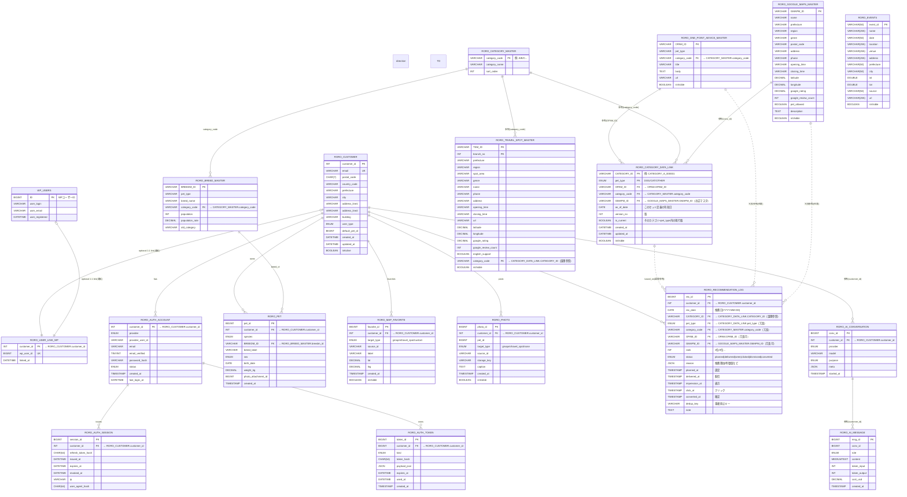

```mermaid
erDiagram
  direction TD

  %% =========================
  %% 外部（WordPress標準）
  %% =========================
  WP_USERS {
    BIGINT ID PK "WPユーザーID"
    VARCHAR user_login
    VARCHAR user_email
    DATETIME user_registered
  }

  %% 顧客情報
  RORO_CUSTOMER {
    INT customer_id PK
    VARCHAR email UK
    CHAR(7) postal_code
    VARCHAR country_code
    VARCHAR prefecture
    VARCHAR city
    VARCHAR address_line1
    VARCHAR address_line2
    VARCHAR building
    ENUM user_type
    BIGINT default_pet_id
    DATETIME created_at
    DATETIME updated_at
    BOOLEAN isActive
  }

  RORO_USER_LINK_WP {
    INT customer_id PK            "→ RORO_CUSTOMER.customer_id"
    BIGINT wp_user_id UK
    DATETIME linked_at
  }

  %% 認証
  RORO_AUTH_ACCOUNT {
    INT customer_id FK            "→ RORO_CUSTOMER.customer_id"
    ENUM provider
    VARCHAR provider_user_id
    VARCHAR email
    TINYINT email_verified
    VARCHAR password_hash
    ENUM status
    TIMESTAMP created_at
    DATETIME last_login_at
  }

  RORO_AUTH_SESSION {
    BIGINT session_id PK
    INT customer_id FK           "→ RORO_CUSTOMER.customer_id"
    CHAR(64) refresh_token_hash
    DATETIME issued_at
    DATETIME expires_at
    DATETIME revoked_at
    VARCHAR ip
    CHAR(64) user_agent_hash
  }

  RORO_AUTH_TOKEN {
    BIGINT token_id PK
    BIGINT customer_id FK          "→ RORO_CUSTOMER.customer_id"
    ENUM kind
    CHAR(64) token_hash
    JSON payload_json
    DATETIME expires_at
    DATETIME used_at
    TIMESTAMP created_at
  }

  %% ペットマスタと飼育ペット
  RORO_BREED_MASTER {
    VARCHAR BREEDM_ID PK
    VARCHAR pet_type
    VARCHAR breed_name
    VARCHAR category_code FK     "→ CATEGORY_MASTER.category_code"
    INT population
    DECIMAL population_rate
    VARCHAR old_category
  }

  RORO_PET {
    BIGINT pet_id PK
    INT customer_id FK           "→ RORO_CUSTOMER.customer_id"
    ENUM species
    VARCHAR BREEDM_ID FK         "→ RORO_BREED_MASTER.breedm_id"
    VARCHAR breed_label
    ENUM sex
    DATE birth_date
    DECIMAL weight_kg
    BIGINT photo_attachment_id
    TIMESTAMP created_at
  }

  %% 施設ソース（独立運用・施設テーブルは無し）
  RORO_GOOGLE_MAPS_MASTER {
    VARCHAR GMAPM_ID PK
    VARCHAR name
    VARCHAR prefecture
    VARCHAR region
    VARCHAR genre
    VARCHAR postal_code
    VARCHAR address
    VARCHAR phone
    VARCHAR opening_time
    VARCHAR closing_time
    DECIMAL latitude
    DECIMAL longitude
    DECIMAL google_rating
    INT google_review_count
    BOOLEAN pet_allowed
    TEXT description
    BOOLEAN isVisible
  }

  RORO_TRAVEL_SPOT_MASTER {
    VARCHAR TSM_ID PK
    INT branch_no PK
    VARCHAR prefecture
    VARCHAR region
    VARCHAR spot_area
    VARCHAR genre
    VARCHAR name
    VARCHAR phone
    VARCHAR address
    VARCHAR opening_time
    VARCHAR closing_time
    VARCHAR url
    DECIMAL latitude
    DECIMAL longitude
    DECIMAL google_rating
    INT google_review_count
    BOOLEAN english_support
    VARCHAR category_code FK           "→ CATEGORY_DATA_LINK.CATEGORY_ID（論理参照）"
    BOOLEAN isVisible
  }

  %% お気に入り（ソースID直参照 or カスタム地点）
  RORO_MAP_FAVORITE {
    BIGINT favorite_id PK
    INT customer_id FK            "→ RORO_CUSTOMER.customer_id"
    ENUM target_type "gmapm/travel_spot/custom"
    VARCHAR source_id
    VARCHAR label
    DECIMAL lat
    DECIMAL lng
    TIMESTAMP created_at
    BOOLEAN isVisible
  }

  %% 写真（ソースID直参照 or none）
  RORO_PHOTO {
    BIGINT photo_id PK
    INT customer_id FK            "→ RORO_CUSTOMER.customer_id"
    BIGINT pet_id
    ENUM target_type "gmapm/travel_spot/none"
    VARCHAR source_id
    VARCHAR storage_key
    TEXT caption
    TIMESTAMP created_at
    BOOLEAN isVisible
  }

  %% OPAM（記事/アドバイス）
  RORO_ONE_POINT_ADVICE_MASTER {
    VARCHAR OPAM_ID PK
    VARCHAR pet_type
    VARCHAR category_code FK        "→ CATEGORY_MASTER.category_code"
    VARCHAR title
    TEXT body
    VARCHAR url
    BOOLEAN isVisible
  }

  %% カテゴリ小マスタ
  RORO_CATEGORY_MASTER {
    VARCHAR category_code PK  "例: A/B/C..."
    VARCHAR category_name
    INT sort_order
  }

  %% ご指定の“データ表”＋版管理（推薦セットの定義）
  RORO_CATEGORY_DATA_LINK {
    VARCHAR CATEGORY_ID PK         "例: CATEGORY_A_000001"
    ENUM   pet_type   PK           "DOG/CAT/OTHER"
    VARCHAR OPAM_ID FK              "→ OPAM.OPAM_ID"
    VARCHAR category_code FK        "→ CATEGORY_MASTER.category_code"
    VARCHAR GMAPM_ID FK             "→ GOOGLE_MAPS_MASTER.GMAPM_ID（お店マスタ）"
    DATE    as_of_date              "このセット定義の有効日"
    INT     version_no              "版"
    BOOLEAN is_current              "そのカテゴリ×pet_type内の現行版"
    DATETIME created_at
    DATETIME updated_at
    BOOLEAN isVisible
  }

  %% 履歴ログのみで運用（ログを根拠に次の紹介を決定）
  RORO_RECOMMENDATION_LOG {
    BIGINT  rec_id PK
    INT     customer_id FK           "→ RORO_CUSTOMER.customer_id"
    DATE    rec_date                 "推薦日(YYYY-MM-DD)"
    VARCHAR CATEGORY_ID FK           "→ CATEGORY_DATA_LINK.CATEGORY_ID（論理参照）"
    ENUM   pet_type     FK           "→ CATEGORY_DATA_LINK.pet_type（冗長）"
    VARCHAR category_code FK         "→ CATEGORY_MASTER.category_code（冗長）"
    VARCHAR OPAM_ID     FK           "→ OPAM.OPAM_ID（冗長可）"
    VARCHAR GMAPM_ID    FK           "→ GOOGLE_MAPS_MASTER.GMAPM_ID（冗長可）"
    INT     rank                     "1位/2位…"
    ENUM    status                   "planned|delivered|seen|clicked|dismissed|converted"
    JSON    reason                   "推薦理由/特徴量など"
    TIMESTAMP planned_at             "選定"
    TIMESTAMP delivered_at           "配信"
    TIMESTAMP impression_at          "表示"
    TIMESTAMP click_at               "クリック"
    TIMESTAMP converted_at           "確定"
    VARCHAR dedup_key                "重複抑止キー"
    TEXT    note
  }

  %% イベント
  RORO_EVENTS {
    VARCHAR(50) event_id PK
    VARCHAR(255) name
    VARCHAR(50)  date
    VARCHAR(255) location
    VARCHAR(255) venue
    VARCHAR(255) address
    VARCHAR(50)  prefecture
    VARCHAR(50)  city
    DOUBLE       lat
    DOUBLE       lon
    VARCHAR(50)  source
    VARCHAR(255) url
    BOOLEAN isVisible
  }

  %% AI関連
  RORO_AI_CONVERSATION {
    BIGINT conv_id PK
    INT customer_id FK            "→ RORO_CUSTOMER.customer_id"
    ENUM provider
    VARCHAR model
    ENUM purpose
    JSON meta
    TIMESTAMP started_at
  }

  RORO_AI_MESSAGE {
    BIGINT msg_id PK
    BIGINT conv_id
    ENUM role
    MEDIUMTEXT content
    INT token_input
    INT token_output
    DECIMAL cost_usd
    TIMESTAMP created_at
  }

  %% =========================
  %% リレーション
  %% =========================
  RORO_CUSTOMER ||--o{ RORO_AUTH_ACCOUNT : "has"
  RORO_AUTH_ACCOUNT ||--o{ RORO_AUTH_SESSION : "issues"
  RORO_AUTH_ACCOUNT ||--o{ RORO_AUTH_TOKEN : "owns"

  RORO_CUSTOMER ||--o{ RORO_PET : "owns"

  %% ★カテゴリと犬種マスタの紐付け（1カテゴリ：多ペット種）
  RORO_CATEGORY_MASTER ||--o{ RORO_BREED_MASTER : "category_code"

  RORO_CATEGORY_MASTER ||--o{ RORO_TRAVEL_SPOT_MASTER : "参照(category_code)"

  RORO_BREED_MASTER ||--o{ RORO_PET : "breed_of"

  RORO_CUSTOMER ||--o{ RORO_MAP_FAVORITE : "favorites"
  RORO_CUSTOMER ||--o{ RORO_PHOTO : "posts"
  RORO_CUSTOMER ||--o{ RORO_AI_CONVERSATION : "参照(customer_id)"
  RORO_AI_CONVERSATION ||--o{ RORO_AI_MESSAGE : "参照(customer_id)"


  RORO_ONE_POINT_ADVICE_MASTER ||--o{ RORO_CATEGORY_DATA_LINK : "参照(OPAM_ID)"
  RORO_CATEGORY_MASTER ||--o{ RORO_CATEGORY_DATA_LINK : "参照(category_code)"
  RORO_GOOGLE_MAPS_MASTER           ||--o{ RORO_CATEGORY_DATA_LINK : "参照(conv_id)"

  %% 履歴ログは推薦セットに“論理参照”。アプリはログを参照→未提示のCATEGORY_DATA_LINKを選定→planned/delivered等を記録
  RORO_CUSTOMER          ||--o{ RORO_RECOMMENDATION_LOG : "receives"
  RORO_CATEGORY_DATA_LINK     ||..o{ RORO_RECOMMENDATION_LOG : "based_on(論理参照)"
  RORO_ONE_POINT_ADVICE_MASTER ||..o{ RORO_RECOMMENDATION_LOG : "冗長参照(任意)"
  RORO_GOOGLE_MAPS_MASTER     ||..o{ RORO_RECOMMENDATION_LOG : "冗長参照(任意)"

  RORO_CUSTOMER o|--|| RORO_USER_LINK_WP : "optional 1:1 link(遅延)"
  WP_USERS      o|--|| RORO_USER_LINK_WP : "optional 1:1 link(遅延)"


```