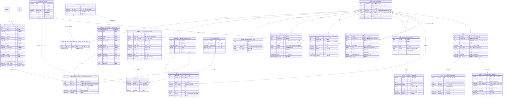

```mermaid
erDiagram
  direction TD

  %% =========================
  %% 外部（WordPress標準）
  %% =========================
  WP_USERS["WPユーザー / WP_USERS"] {
    BIGINT ID PK "WPユーザーID / WordPress User ID"
    VARCHAR user_login "ユーザー名 / Login Name"
    VARCHAR user_email "メールアドレス / Email"
    DATETIME user_registered "登録日時 / Registered"
  }

  %% ======================================
  %% 顧客（アプリ利用者）＋ WP遅延リンク(任意1:1)
  %% ======================================
  RORO_CUSTOMER["顧客 / RORO_CUSTOMER"] {
    INT customer_id PK "顧客ID / Customer ID"
    VARCHAR email UK "メールアドレス / Email (一意)"
    CHAR(7) postal_code "郵便番号 / Postal Code"
    ENUM user_type "ユーザー種別(local/social/admin) / User Type"
    BIGINT default_pet_id FK "既定ペットID(任意FK→RORO_PET.pet_id)"
    DATETIME created_at "作成日時 / Created At"
    DATETIME updated_at "更新日時 / Updated At"
  }

  RORO_USER_LINK_WP["顧客とWPユーザーの紐付け(遅延リンク) / RORO_USER_LINK_WP"] {
    INT customer_id PK, FK "顧客ID / Customer ID"
    BIGINT wp_user_id UK, FK "WPユーザーID / WP User ID (一意)"
    DATETIME linked_at "連携日時 / Linked At"
  }

  %% =========================
  %% 認証（任意：local/ソーシャル）
  %% =========================
  RORO_AUTH_ACCOUNT["認証アカウント / RORO_AUTH_ACCOUNT"] {
    BIGINT account_id PK "アカウントID / Account ID"
    INT customer_id FK "顧客ID / Customer ID"
    ENUM provider "認証プロバイダ(local/google/line等) / Provider"
    VARCHAR provider_user_id "外部ユーザーID / Provider User ID"
    VARCHAR email "メールアドレス / Email"
    TINYINT email_verified "メール確認済 / Email Verified"
    VARCHAR password_hash "パスワードハッシュ(localのみ)"
    ENUM status "状態(active/locked/deleted) / Status"
    TIMESTAMP created_at "作成日時 / Created At"
    DATETIME last_login_at "最終ログイン日時 / Last Login At"
  }

  RORO_AUTH_SESSION["認証セッション / RORO_AUTH_SESSION"] {
    BIGINT session_id PK "セッションID / Session ID"
    BIGINT account_id FK "アカウントID / Account ID"
    INT customer_id FK "顧客ID / Customer ID"
    CHAR(64) refresh_token_hash "リフレッシュトークンハッシュ"
    DATETIME issued_at "発行日時"
    DATETIME expires_at "有効期限"
    DATETIME revoked_at "失効日時"
    VARCHAR ip "IPアドレス"
    CHAR(64) user_agent_hash "UAハッシュ"
  }

  RORO_AUTH_TOKEN["認証トークン / RORO_AUTH_TOKEN"] {
    BIGINT token_id PK "トークンID / Token ID"
    BIGINT account_id FK "アカウントID / Account ID"
    ENUM kind "種別(verify_email/password_reset/oauth_state)"
    CHAR(64) token_hash "トークンハッシュ"
    JSON payload_json "付加情報(JSON)"
    DATETIME expires_at "有効期限"
    DATETIME used_at "使用日時"
    TIMESTAMP created_at "作成日時"
  }

  %% =========================
  %% ペット（顧客1:N、代表ペットは任意）
  %% =========================
  PET_MASTER["ペットマスタ / PET_MASTER"] {
    VARCHAR PETM_ID PK "ペットID / Breed ID"
    VARCHAR pet_type "ペット区分"
    VARCHAR breed_name "ペット名"
    VARCHAR category_code "カテゴリコード"
    INT population "飼育数(任意)"
    DECIMAL population_rate "飼育率(任意)"
    VARCHAR old_category "旧カテゴリ(任意)"
  }

  RORO_PET["ペット / RORO_PET"] {
    BIGINT pet_id PK "ペットID / Pet ID"
    INT customer_id FK "飼い主の顧客ID / Owner Customer ID"
    ENUM species "種別(dog/cat/other)"
    VARCHAR PETM_ID FK "ペットID(→PET_MASTER.PETM_ID)"
    VARCHAR breed_label "ペット表示名(任意)"
    ENUM sex "性別(unknown/male/female)"
    DATE birth_date "誕生日(任意)"
    DECIMAL weight_kg "体重kg(任意)"
    BIGINT photo_attachment_id "写真添付ID(任意)"
    TIMESTAMP created_at "作成日時"
  }

  %% ======================================================
  %% 施設系（GMAPM=施設マスタ、TRAVEL_SPOT=観光スポットExcel）
  %% ＋ 正規化された内製施設マスタ＆お気に入り
  %% ======================================================
  GMAPM["施設マスタ(Google Mapsベース) / GMAPM"] {
    VARCHAR GMAPM_ID PK "施設ID"
    VARCHAR name "施設名"
    VARCHAR prefecture "都道府県"
    VARCHAR region "地域"
    VARCHAR genre "ジャンル"
    VARCHAR postal_code "郵便番号"
    VARCHAR address "住所"
    VARCHAR phone "電話番号"
    VARCHAR opening_time "営業開始"
    VARCHAR closing_time "営業終了"
    DECIMAL latitude "緯度"
    DECIMAL longitude "経度"
    DECIMAL google_rating "口コミ点数"
    INT google_review_count "口コミ件数"
    BOOLEAN pet_allowed "ペット可"
    TEXT description "概要"
  }

  TRAVEL_SPOT["観光スポット(Excelマスタ) / TRAVEL_SPOT"] {
    VARCHAR TSM_ID PK "スポットID"
    INT branch_no PK "枝番"
    VARCHAR prefecture "都道府県"
    VARCHAR region "地方"
    VARCHAR spot_area "地点"
    VARCHAR genre "ジャンル"
    VARCHAR name "施設名"
    VARCHAR phone "電話番号"
    VARCHAR address "住所"
    VARCHAR opening_time "営業開始"
    VARCHAR closing_time "営業終了"
    VARCHAR url "URL"
    DECIMAL latitude "緯度"
    DECIMAL longitude "経度"
    DECIMAL google_rating "口コミ点数"
    INT google_review_count "口コミ件数"
    BOOLEAN english_support "英語対応"
    VARCHAR category_code "カテゴリコード"
  }

  RORO_FACILITY["施設(正規化・検索最適) / RORO_FACILITY"] {
    BIGINT facility_id PK "施設ID"
    VARCHAR name "施設名"
    VARCHAR category "カテゴリ"
    DECIMAL lat "緯度"
    DECIMAL lng "経度"
    POINT facility_pt "生成列: POINT(lng,lat) SRID 4326"
  }

  RORO_FACILITY_SOURCE_MAP["施設ソース対応表 / RORO_FACILITY_SOURCE_MAP"] {
    BIGINT map_id PK "対応ID"
    BIGINT facility_id FK "内製施設ID → RORO_FACILITY"
    ENUM source_type "ソース種別(GMAPM/TRAVEL_SPOT/GOOGLE)"
    VARCHAR source_id "ソース側ID(GMAPM_ID/TSM_ID等)"
    INT branch_no "枝番(Travel Spot用,任意)"
    VARCHAR google_place_id "Google Place ID(任意)"
    TIMESTAMP created_at "作成日時"
  }

  RORO_MAP_FAVORITE["地図お気に入り / RORO_MAP_FAVORITE"] {
    BIGINT favorite_id PK "お気に入りID"
    INT customer_id FK "顧客ID"
    ENUM target_type "対象種別(facility/spot/custom/place)"
    BIGINT target_id "対象ID(任意)"
    VARCHAR google_place_id "Google Place ID(任意)"
    VARCHAR label "ラベル"
    DECIMAL lat "緯度"
    DECIMAL lng "経度"
    POINT place_pt "生成列: POINT(lng,lat) SRID 4326"
    TIMESTAMP created_at "作成日時"
  }

  %% =========================
  %% コンテンツ（ワンポイント/記事等）
  %% =========================
  OPAM["記事/アドバイス / OPAM"] {
    VARCHAR OPAM_ID PK "記事ID"
    VARCHAR pet_type "ペット区分"
    VARCHAR category_code "カテゴリコード"
    VARCHAR title "タイトル"
    TEXT body "本文"
    VARCHAR url "URL"
  }

  CATEGORY_LINK["カテゴリ連携 / CATEGORY_LINK"] {
    VARCHAR CATEGORY_ID PK "カテゴリ連携ID"
    VARCHAR pet_type "ペット区分"
    VARCHAR category_code "カテゴリコード"
    VARCHAR OPAM_ID FK "アドバイスID"
    VARCHAR GMAPM_ID FK "施設ID"
  }

  %% =========================
  %% 生成AI（任意利用：会話開始後に生成）
  %% =========================
  RORO_AI_CONVERSATION["AI会話 / RORO_AI_CONVERSATION"] {
    BIGINT conv_id PK "会話ID"
    INT customer_id FK "顧客ID"
    ENUM provider "生成AIプロバイダ(openai/dify等)"
    VARCHAR model "モデル名"
    ENUM purpose "用途(advice/qa/support等)"
    JSON meta "メタ情報(JSON)"
    TIMESTAMP started_at "開始日時"
  }

  RORO_AI_MESSAGE["AIメッセージ / RORO_AI_MESSAGE"] {
    BIGINT msg_id PK "メッセージID"
    BIGINT conv_id FK "会話ID"
    ENUM role "役割(system/user/assistant/tool)"
    MEDIUMTEXT content "本文"
    INT token_input "入力トークン数"
    INT token_output "出力トークン数"
    DECIMAL cost_usd "推定コストUSD"
    TIMESTAMP created_at "作成日時"
  }

  %% =========================
  %% 行動ログ・同意・監査（任意）
  %% =========================
  RORO_LINK_CLICK["リンククリック / RORO_LINK_CLICK"] {
    BIGINT click_id PK "クリックID"
    INT customer_id FK "顧客ID"
    ENUM context_type "文脈種別(ad/advice/facility等)"
    BIGINT context_id "文脈ID"
    VARCHAR url "URL"
    VARCHAR referrer "リファラ"
    CHAR(64) ip_hash "IPハッシュ"
    CHAR(64) user_agent_hash "UAハッシュ"
    TIMESTAMP created_at "作成日時"
  }

  RORO_RECOMMENDATION_LOG["レコメンド配信ログ / RORO_RECOMMENDATION_LOG"] {
    BIGINT rec_id PK "記録ID"
    INT customer_id FK "顧客ID"
    ENUM item_type "アイテム種別(advice/facility/event等)"
    BIGINT item_id "アイテムID"
    ENUM channel "配信チャネル(app/web/email/line/push)"
    JSON reason "推薦理由(JSON)"
    TIMESTAMP delivered_at "配信日時"
    TIMESTAMP impression_at "表示日時"
    TIMESTAMP click_at "クリック日時"
    TIMESTAMP dismissed_at "却下日時"
  }

  RORO_CONSENT_LOG["同意履歴 / RORO_CONSENT_LOG"] {
    BIGINT log_id PK "履歴ID"
    INT customer_id FK "顧客ID"
    ENUM old_status "旧同意状態(unknown/agreed/revoked)"
    ENUM new_status "新同意状態"
    TIMESTAMP changed_at "変更日時"
  }

  RORO_AUDIT_EVENT["監査イベント / RORO_AUDIT_EVENT"] {
    BIGINT audit_id PK "監査ID"
    ENUM actor_type "操作主体(user/admin/system)"
    BIGINT actor_wp_user_id FK "WPユーザーID(任意)"
    INT actor_customer_id FK "顧客ID(任意)"
    VARCHAR event_type "イベント種別(insert/update/delete/login等)"
    VARCHAR entity_table "対象テーブル名"
    VARCHAR entity_pk "対象主キー値"
    JSON before_json "変更前JSON"
    JSON after_json "変更後JSON"
    VARCHAR ip "IPアドレス"
    VARCHAR user_agent "ユーザーエージェント"
    TIMESTAMP created_at "作成日時"
  }

  %% =========================
  %% リレーション
  %% =========================
  %% 顧客と認証
  RORO_CUSTOMER ||--o{ RORO_AUTH_ACCOUNT : "has_account"
  RORO_AUTH_ACCOUNT ||--o{ RORO_AUTH_SESSION : "issues_session"
  RORO_AUTH_ACCOUNT ||--o{ RORO_AUTH_TOKEN  : "owns_token"

  %% 顧客とペット（代表ペットは任意）
  RORO_CUSTOMER ||--o{ RORO_PET : "owns"
  PET_MASTER ||--o{ RORO_PET : "breed_of"
  RORO_CUSTOMER o|--|| RORO_PET : "default_pet(任意)"

  %% 施設・スポット・カテゴリ連携
  GMAPM ||--o{ CATEGORY_LINK : "1対多"
  OPAM  ||--o{ CATEGORY_LINK : "1対多"
  PET_MASTER }o--o{ CATEGORY_LINK : "多対多(カテゴリコード)"
  PET_MASTER }o..o{ TRAVEL_SPOT : "任意関連(カテゴリコード)"

  %% 施設の正規化マッピング
  RORO_FACILITY ||--o{ RORO_FACILITY_SOURCE_MAP : "has_sources"
  GMAPM        ||--o{ RORO_FACILITY_SOURCE_MAP : "source_gmapm"
  TRAVEL_SPOT  ||--o{ RORO_FACILITY_SOURCE_MAP : "source_travel_spot"

  %% お気に入り
  RORO_CUSTOMER ||--o{ RORO_MAP_FAVORITE : "favorites"
  RORO_FACILITY ||--o{ RORO_MAP_FAVORITE : "referenced_facility"

  %% 生成AI（任意利用）
  RORO_CUSTOMER ||--o{ RORO_AI_CONVERSATION : "starts(任意)"
  RORO_AI_CONVERSATION ||--o{ RORO_AI_MESSAGE : "contains"

  %% 行動ログ・同意・監査
  RORO_CUSTOMER ||--o{ RORO_LINK_CLICK         : "clicks"
  RORO_CUSTOMER ||--o{ RORO_RECOMMENDATION_LOG : "receives"
  RORO_CUSTOMER ||--o{ RORO_CONSENT_LOG        : "updates_consent"
  WP_USERS      ||--o{ RORO_AUDIT_EVENT        : "acts_as_admin"
  RORO_CUSTOMER ||--o{ RORO_AUDIT_EVENT        : "acts_as_user"

  %% 遅延リンク（行が無ければ“未連携”）
  RORO_CUSTOMER o|--|| RORO_USER_LINK_WP : "optional 1:1 link (遅延)"
  WP_USERS      o|--|| RORO_USER_LINK_WP : "optional 1:1 link (遅延)"


```