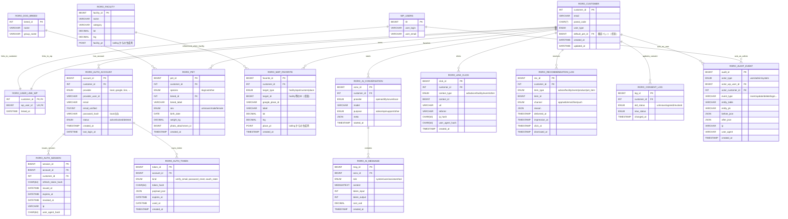

```mermaid
erDiagram
  WP_USERS {
    BIGINT ID PK
    VARCHAR user_login
    VARCHAR user_email
  }

  RORO_CUSTOMER {
    INT customer_id PK
    VARCHAR email
    CHAR(7) postal_code
    ENUM user_type
    BIGINT default_pet_id FK "既定ペット（任意）"
    DATETIME created_at
    DATETIME updated_at
  }

  RORO_USER_LINK_WP {
    INT customer_id PK, FK
    BIGINT wp_user_id UK, FK
    DATETIME linked_at
  }

  RORO_AUTH_ACCOUNT {
    BIGINT account_id PK
    INT customer_id FK
    ENUM provider "local, google, line, ..."
    VARCHAR provider_user_id
    VARCHAR email
    TINYINT email_verified
    VARCHAR password_hash "localのみ"
    ENUM status "active/locked/deleted"
    TIMESTAMP created_at
    DATETIME last_login_at
  }

  RORO_AUTH_SESSION {
    BIGINT session_id PK
    BIGINT account_id FK
    INT customer_id FK
    CHAR(64) refresh_token_hash
    DATETIME issued_at
    DATETIME expires_at
    DATETIME revoked_at
    VARCHAR ip
    CHAR(64) user_agent_hash
  }

  RORO_AUTH_TOKEN {
    BIGINT token_id PK
    BIGINT account_id FK
    ENUM kind "verify_email, password_reset, oauth_state"
    CHAR(64) token_hash
    JSON payload_json
    DATETIME expires_at
    DATETIME used_at
    TIMESTAMP created_at
  }

  RORO_DOG_BREED {
    INT breed_id PK
    VARCHAR name
    VARCHAR group_name
  }

  RORO_PET {
    BIGINT pet_id PK
    INT customer_id FK
    ENUM species "dog/cat/other"
    INT breed_id FK
    VARCHAR breed_label
    ENUM sex "unknown/male/female"
    DATE birth_date
    DECIMAL weight_kg
    BIGINT photo_attachment_id
    TIMESTAMP created_at
  }

  RORO_FACILITY {
    BIGINT facility_id PK
    VARCHAR name
    VARCHAR category
    DECIMAL lat
    DECIMAL lng
    POINT facility_pt "lat/lng からの生成列"
  }

  RORO_MAP_FAVORITE {
    BIGINT favorite_id PK
    INT customer_id FK
    ENUM target_type "facility/spot/custom/place"
    BIGINT target_id "facility等のID（任意）"
    VARCHAR google_place_id
    VARCHAR label
    DECIMAL lat
    DECIMAL lng
    POINT place_pt "lat/lng からの生成列"
    TIMESTAMP created_at
  }

  RORO_AI_CONVERSATION {
    BIGINT conv_id PK
    INT customer_id FK
    ENUM provider "openai/dify/azure/local"
    VARCHAR model
    ENUM purpose "advice/qa/support/other"
    JSON meta
    TIMESTAMP started_at
  }

  RORO_AI_MESSAGE {
    BIGINT msg_id PK
    BIGINT conv_id FK
    ENUM role "system/user/assistant/tool"
    MEDIUMTEXT content
    INT token_input
    INT token_output
    DECIMAL cost_usd
    TIMESTAMP created_at
  }

  RORO_LINK_CLICK {
    BIGINT click_id PK
    INT customer_id FK
    ENUM context_type "ad/advice/facility/event/other"
    BIGINT context_id
    VARCHAR url
    VARCHAR referrer
    CHAR(64) ip_hash
    CHAR(64) user_agent_hash
    TIMESTAMP created_at
  }

  RORO_RECOMMENDATION_LOG {
    BIGINT rec_id PK
    INT customer_id FK
    ENUM item_type "advice/facility/event/product/pet_item"
    BIGINT item_id
    ENUM channel "app/web/email/line/push"
    JSON reason
    TIMESTAMP delivered_at
    TIMESTAMP impression_at
    TIMESTAMP click_at
    TIMESTAMP dismissed_at
  }

  RORO_CONSENT_LOG {
    BIGINT log_id PK
    INT customer_id FK
    ENUM old_status "unknown/agreed/revoked"
    ENUM new_status
    TIMESTAMP changed_at
  }

  RORO_AUDIT_EVENT {
    BIGINT audit_id PK
    ENUM actor_type "user/admin/system"
    BIGINT actor_wp_user_id FK
    INT actor_customer_id FK
    VARCHAR event_type "insert/update/delete/login..."
    VARCHAR entity_table
    VARCHAR entity_pk
    JSON before_json
    JSON after_json
    VARCHAR ip
    VARCHAR user_agent
    TIMESTAMP created_at
  }

  %% ────────── リレーション ──────────
  RORO_CUSTOMER ||--o{ RORO_AUTH_ACCOUNT : has_account
  RORO_AUTH_ACCOUNT ||--o{ RORO_AUTH_SESSION : issues_session
  RORO_AUTH_ACCOUNT ||--o{ RORO_AUTH_TOKEN : owns_token

  RORO_CUSTOMER ||--o{ RORO_PET : owns
  RORO_DOG_BREED ||--o{ RORO_PET : categorizes
  RORO_CUSTOMER ||--o{ RORO_MAP_FAVORITE : favorites
  RORO_FACILITY ||--o{ RORO_MAP_FAVORITE : referenced_when_facility

  RORO_CUSTOMER ||--o{ RORO_AI_CONVERSATION : starts
  RORO_AI_CONVERSATION ||--o{ RORO_AI_MESSAGE : contains

  RORO_CUSTOMER ||--o{ RORO_LINK_CLICK : clicks
  RORO_CUSTOMER ||--o{ RORO_RECOMMENDATION_LOG : receives
  RORO_CUSTOMER ||--o{ RORO_CONSENT_LOG : updates_consent

  RORO_CUSTOMER ||--|| RORO_USER_LINK_WP : links_to_wp
  WP_USERS ||--|| RORO_USER_LINK_WP : links_to_customer

  WP_USERS ||--o{ RORO_AUDIT_EVENT : acts_as_admin
  RORO_CUSTOMER ||--o{ RORO_AUDIT_EVENT : acts_as_user
```