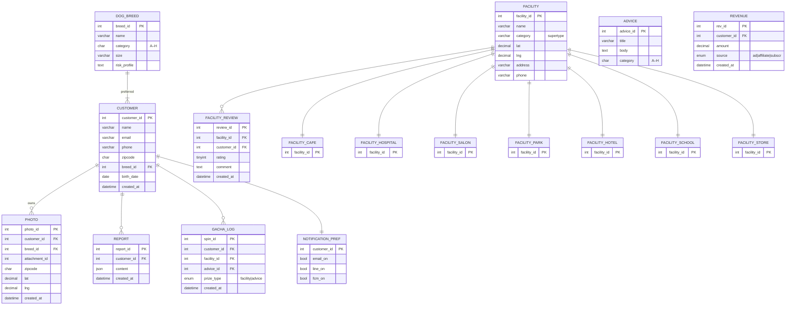

```mermaid
erDiagram
    %% ===== マスタ =====
    DOG_BREED ||--|{ CUSTOMER : "preferred"
    DOG_BREED {
        int breed_id PK
        varchar name
        char category "A–H"
        varchar size
        text risk_profile
    }

    FACILITY ||--o{ FACILITY_REVIEW : ""
    FACILITY ||--|| FACILITY_CAFE : ""
    FACILITY ||--|| FACILITY_HOSPITAL : ""
    FACILITY ||--|| FACILITY_SALON : ""
    FACILITY ||--|| FACILITY_PARK : ""
    FACILITY ||--|| FACILITY_HOTEL : ""
    FACILITY ||--|| FACILITY_SCHOOL : ""
    FACILITY ||--|| FACILITY_STORE : ""
    FACILITY {
        int facility_id PK
        varchar name
        varchar category "supertype"
        decimal lat
        decimal lng
        varchar address
        varchar phone
    }

    FACILITY_CAFE     { int facility_id PK }
    FACILITY_HOSPITAL { int facility_id PK }
    FACILITY_SALON    { int facility_id PK }
    FACILITY_PARK     { int facility_id PK }
    FACILITY_HOTEL    { int facility_id PK }
    FACILITY_SCHOOL   { int facility_id PK }
    FACILITY_STORE    { int facility_id PK }

    ADVICE {
        int advice_id PK
        varchar title
        text body
        char category "A–H"
    }

    %% ===== 顧客・設定 =====
    CUSTOMER ||--o{ PHOTO : "owns"
    CUSTOMER ||--o{ REPORT : ""
    CUSTOMER ||--o{ GACHA_LOG : ""
    CUSTOMER ||--|| NOTIFICATION_PREF : ""
    CUSTOMER {
        int customer_id PK
        varchar name
        varchar email
        varchar phone
        char zipcode
        int breed_id FK
        date birth_date
        datetime created_at
    }

    NOTIFICATION_PREF {
        int customer_id PK
        bool email_on
        bool line_on
        bool fcm_on
    }

    %% ===== アプリ動作ログ =====
    PHOTO {
        int photo_id PK
        int customer_id FK
        int breed_id FK
        int attachment_id
        char zipcode
        decimal lat
        decimal lng
        datetime created_at
    }

    REPORT {
        int report_id PK
        int customer_id FK
        json content
        datetime created_at
    }

    GACHA_LOG {
        int spin_id PK
        int customer_id FK
        int facility_id FK
        int advice_id FK
        enum prize_type "facility|advice"
        datetime created_at
    }

    FACILITY_REVIEW {
        int review_id PK
        int facility_id FK
        int customer_id FK
        tinyint rating
        text comment
        datetime created_at
    }

    %% ===== 売上 / KPI =====
    REVENUE {
        int rev_id PK
        int customer_id FK
        decimal amount
        enum source "ad|affiliate|subscr"
        datetime created_at
    }
```