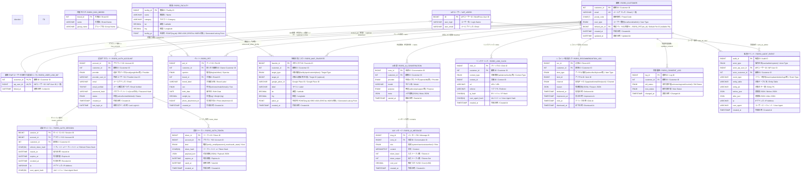

```mermaid
erDiagram
  direction TD

  %% --- 外部（WordPress標準） ---
  WP_USERS["WPユーザー / WP_USERS"] {
    BIGINT ID PK "WPユーザーID / WordPress User ID"
    VARCHAR user_login "ユーザー名 / Login Name"
    VARCHAR user_email "メールアドレス / Email"
  }

  %% --- 顧客・WP遅延リンク ---
  RORO_CUSTOMER["顧客 / RORO_CUSTOMER"] {
    INT customer_id PK "顧客ID / Customer ID"
    VARCHAR email UK "メールアドレス / Email (一意)"
    CHAR(7) postal_code "郵便番号 / Postal Code"
    ENUM user_type "ユーザー種別(local/social/admin) / User Type"
    BIGINT default_pet_id FK "既定ペットID(任意FK→RORO_PET.pet_id) / Default Pet ID (nullable FK)"
    DATETIME created_at "作成日時 / Created At"
    DATETIME updated_at "更新日時 / Updated At"
  }

  RORO_USER_LINK_WP["顧客とWPユーザーの紐付け(遅延リンク) / RORO_USER_LINK_WP"] {
    INT customer_id PK, FK "顧客ID / Customer ID"
    BIGINT wp_user_id UK, FK "WPユーザーID / WP User ID (一意)"
    DATETIME linked_at "連携日時 / Linked At"
  }

  %% --- 認証（任意：local/ソーシャル双方を許容） ---
  RORO_AUTH_ACCOUNT["認証アカウント / RORO_AUTH_ACCOUNT"] {
    BIGINT account_id PK "アカウントID / Account ID"
    INT customer_id FK "顧客ID / Customer ID"
    ENUM provider "認証プロバイダ(local/google/line等) / Provider"
    VARCHAR provider_user_id "外部ユーザーID / Provider User ID"
    VARCHAR email "メールアドレス / Email"
    TINYINT email_verified "メール確認済フラグ / Email Verified"
    VARCHAR password_hash "パスワードハッシュ(localのみ) / Password Hash"
    ENUM status "状態(active/locked/deleted) / Status"
    TIMESTAMP created_at "作成日時 / Created At"
    DATETIME last_login_at "最終ログイン日時 / Last Login At"
  }

  RORO_AUTH_SESSION["認証セッション / RORO_AUTH_SESSION"] {
    BIGINT session_id PK "セッションID / Session ID"
    BIGINT account_id FK "アカウントID / Account ID"
    INT customer_id FK "顧客ID / Customer ID"
    CHAR(64) refresh_token_hash "リフレッシュトークンハッシュ / Refresh Token Hash"
    DATETIME issued_at "発行日時 / Issued At"
    DATETIME expires_at "有効期限 / Expires At"
    DATETIME revoked_at "失効日時 / Revoked At"
    VARCHAR ip "IPアドレス / IP Address"
    CHAR(64) user_agent_hash "UAハッシュ / User-Agent Hash"
  }

  RORO_AUTH_TOKEN["認証トークン / RORO_AUTH_TOKEN"] {
    BIGINT token_id PK "トークンID / Token ID"
    BIGINT account_id FK "アカウントID / Account ID"
    ENUM kind "種別(verify_email/password_reset/oauth_state) / Kind"
    CHAR(64) token_hash "トークンハッシュ / Token Hash"
    JSON payload_json "付加情報(JSON) / Payload JSON"
    DATETIME expires_at "有効期限 / Expires At"
    DATETIME used_at "使用日時 / Used At"
    TIMESTAMP created_at "作成日時 / Created At"
  }

  %% --- ペット（顧客1:N、代表ペットは任意） ---
  RORO_DOG_BREED["犬種マスタ / RORO_DOG_BREED"] {
    INT breed_id PK "犬種ID / Breed ID"
    VARCHAR name "犬種名 / Breed Name"
    VARCHAR group_name "グループ名 / Group Name"
  }

  RORO_PET["ペット / RORO_PET"] {
    BIGINT pet_id PK "ペットID / Pet ID"
    INT customer_id FK "飼い主の顧客ID / Owner Customer ID"
    ENUM species "種別(dog/cat/other) / Species"
    INT breed_id FK "犬種ID / Breed ID"
    VARCHAR breed_label "犬種表示名 / Breed Label"
    ENUM sex "性別(unknown/male/female) / Sex"
    DATE birth_date "誕生日 / Birth Date"
    DECIMAL weight_kg "体重(kg) / Weight (kg)"
    BIGINT photo_attachment_id "写真添付ID / Photo Attachment ID"
    TIMESTAMP created_at "作成日時 / Created At"
  }

  %% --- 施設・お気に入り（空間列はSRID 4326前提） ---
  RORO_FACILITY["施設 / RORO_FACILITY"] {
    BIGINT facility_id PK "施設ID / Facility ID"
    VARCHAR name "施設名 / Name"
    VARCHAR category "カテゴリ / Category"
    DECIMAL lat "緯度 / Latitude"
    DECIMAL lng "経度 / Longitude"
    POINT facility_pt "生成列: POINT(lng,lat) SRID 4326 (SPATIAL INDEX対象) / Generated LatLng Point"
  }

  RORO_MAP_FAVORITE["地図お気に入り / RORO_MAP_FAVORITE"] {
    BIGINT favorite_id PK "お気に入りID / Favorite ID"
    INT customer_id FK "顧客ID / Customer ID"
    ENUM target_type "対象種別(facility/spot/custom/place) / Target Type"
    BIGINT target_id "対象ID(施設等 任意) / Target ID (optional)"
    VARCHAR google_place_id "Google Place ID / Google Place ID"
    VARCHAR label "ラベル / Label"
    DECIMAL lat "緯度 / Latitude"
    DECIMAL lng "経度 / Longitude"
    POINT place_pt "生成列: POINT(lng,lat) SRID 4326 (SPATIAL INDEX対象) / Generated LatLng Point"
    TIMESTAMP created_at "作成日時 / Created At"
  }

  %% --- 生成AI（任意利用：会話が始まってからレコード生成） ---
  RORO_AI_CONVERSATION["AI会話 / RORO_AI_CONVERSATION"] {
    BIGINT conv_id PK "会話ID / Conversation ID"
    INT customer_id FK "顧客ID / Customer ID"
    ENUM provider "生成AIプロバイダ(openai/dify等) / Provider"
    VARCHAR model "モデル名 / Model"
    ENUM purpose "用途(advice/qa/support等) / Purpose"
    JSON meta "メタ情報(JSON) / Meta JSON"
    TIMESTAMP started_at "開始日時 / Started At"
  }

  RORO_AI_MESSAGE["AIメッセージ / RORO_AI_MESSAGE"] {
    BIGINT msg_id PK "メッセージID / Message ID"
    BIGINT conv_id FK "会話ID / Conversation ID"
    ENUM role "役割(system/user/assistant/tool) / Role"
    MEDIUMTEXT content "本文 / Content"
    INT token_input "入力トークン数 / Tokens In"
    INT token_output "出力トークン数 / Tokens Out"
    DECIMAL cost_usd "推定コストUSD / Cost (USD)"
    TIMESTAMP created_at "作成日時 / Created At"
  }

  %% --- 行動ログ・同意・監査（任意利用） ---
  RORO_LINK_CLICK["リンククリック / RORO_LINK_CLICK"] {
    BIGINT click_id PK "クリックID / Click ID"
    INT customer_id FK "顧客ID / Customer ID"
    ENUM context_type "文脈種別(ad/advice/facility等) / Context Type"
    BIGINT context_id "文脈ID / Context ID"
    VARCHAR url "URL / URL"
    VARCHAR referrer "リファラ / Referrer"
    CHAR(64) ip_hash "IPハッシュ / IP Hash"
    CHAR(64) user_agent_hash "UAハッシュ / User-Agent Hash"
    TIMESTAMP created_at "作成日時 / Created At"
  }

  RORO_RECOMMENDATION_LOG["レコメンド配信ログ / RORO_RECOMMENDATION_LOG"] {
    BIGINT rec_id PK "記録ID / Record ID"
    INT customer_id FK "顧客ID / Customer ID"
    ENUM item_type "アイテム種別(advice/facility/event等) / Item Type"
    BIGINT item_id "アイテムID / Item ID"
    ENUM channel "配信チャネル(app/web/email/line/push) / Channel"
    JSON reason "推薦理由(JSON) / Reason JSON"
    TIMESTAMP delivered_at "配信日時 / Delivered At"
    TIMESTAMP impression_at "表示日時 / Impression At"
    TIMESTAMP click_at "クリック日時 / Click At"
    TIMESTAMP dismissed_at "却下日時 / Dismissed At"
  }

  RORO_CONSENT_LOG["同意履歴 / RORO_CONSENT_LOG"] {
    BIGINT log_id PK "履歴ID / Log ID"
    INT customer_id FK "顧客ID / Customer ID"
    ENUM old_status "旧同意状態(unknown/agreed/revoked) / Old Status"
    ENUM new_status "新同意状態 / New Status"
    TIMESTAMP changed_at "変更日時 / Changed At"
  }

  RORO_AUDIT_EVENT["監査イベント / RORO_AUDIT_EVENT"] {
    BIGINT audit_id PK "監査ID / Audit ID"
    ENUM actor_type "操作主体(user/admin/system) / Actor Type"
    BIGINT actor_wp_user_id FK "WPユーザーID / WP User ID"
    INT actor_customer_id FK "顧客ID / Customer ID"
    VARCHAR event_type "イベント種別(insert/update/delete/login等) / Event Type"
    VARCHAR entity_table "対象テーブル名 / Entity Table"
    VARCHAR entity_pk "対象主キー値 / Entity PK"
    JSON before_json "変更前JSON / Before JSON"
    JSON after_json "変更後JSON / After JSON"
    VARCHAR ip "IPアドレス / IP Address"
    VARCHAR user_agent "ユーザーエージェント / User Agent"
    TIMESTAMP created_at "作成日時 / Created At"
  }

  %% --- 関連（カーディナリティを明確化） ---
  RORO_CUSTOMER ||--o{ RORO_AUTH_ACCOUNT : "アカウントを持つ / has_account"
  RORO_AUTH_ACCOUNT ||--o{ RORO_AUTH_SESSION : "セッション発行 / issues_session"
  RORO_AUTH_ACCOUNT ||--o{ RORO_AUTH_TOKEN  : "トークン所有 / owns_token"

  RORO_CUSTOMER ||--o{ RORO_PET           : "ペットを所有 / owns"
  RORO_DOG_BREED ||--o{ RORO_PET          : "犬種に分類 / categorizes"
  RORO_CUSTOMER ||--o{ RORO_MAP_FAVORITE  : "お気に入り登録 / favorites"
  RORO_FACILITY  ||--o{ RORO_MAP_FAVORITE : "施設として参照 / referenced_when_facility"

  %% 代表ペットは任意（default_pet用の補助的関連）
  RORO_CUSTOMER o|--|| RORO_PET : "default_pet（任意） / optional default pet"

  %% AIは“使われ始めてから”の任意利用
  RORO_CUSTOMER ||--o{ RORO_AI_CONVERSATION : "会話開始（任意利用） / starts"
  RORO_AI_CONVERSATION ||--o{ RORO_AI_MESSAGE : "メッセージ含有 / contains"

  RORO_CUSTOMER ||--o{ RORO_LINK_CLICK         : "リンククリック / clicks"
  RORO_CUSTOMER ||--o{ RORO_RECOMMENDATION_LOG : "レコメンド受信 / receives"
  RORO_CUSTOMER ||--o{ RORO_CONSENT_LOG        : "同意状態更新 / updates_consent"

  %% 遅延リンク（行が無ければ“未連携”）
  RORO_CUSTOMER o|--|| RORO_USER_LINK_WP : "WP連携（任意の1:1 / 遅延リンク） / optional 1:1 link"
  WP_USERS      o|--|| RORO_USER_LINK_WP : "顧客連携（任意の1:1） / optional 1:1 link"

  %% 監査（管理者/顧客どちらの操作も記録）
  WP_USERS      ||--o{ RORO_AUDIT_EVENT  : "管理操作 / acts_as_admin"
  RORO_CUSTOMER ||--o{ RORO_AUDIT_EVENT  : "ユーザー操作 / acts_as_user"

```