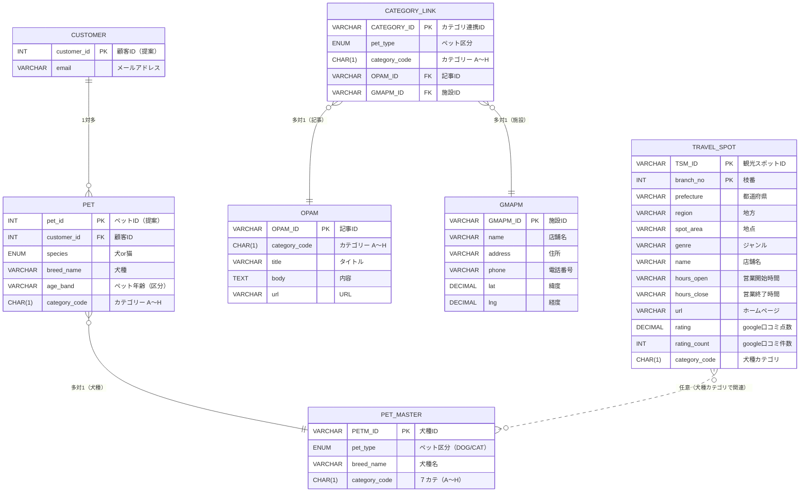

# 論理データモデル（自動生成）

*生成時刻: 2025-08-11 05:51*

## エンティティ一覧（シート対応）

- 顧客情報テーブル → CUSTOMER / PET（正規化提案）
- 【凍結】googlemapマスタデータ（お店、公園etc) → GMAPM（施設マスタ）
- 【凍結】onepointadviceマスタデータ → OPAM（ワンポイントアドバイス記事）
- 観光スポットマスタデータ → TRAVEL_SPOT（観光スポット）
- ペットマスタ(犬種マスタ) → PET_MASTER（犬種マスタ）
- 犬A〜Hカテゴリー／猫テーブル → CATEGORY_LINK（カテゴリ連携・統合）

## Mermaid ER 図

---

## 顧客情報テーブル

- **主キー候補**: ID

|列名|型(推定)|NULL件数|ユニーク件数|サンプル|
|---|---:|---:|---:|---|
|1.0|INTEGER|0|4|1.0|
|はい|VARCHAR(2)|0|1|はい|
|ルル|VARCHAR(4)|0|2|ルル|
|犬|VARCHAR(1)|0|2|犬|
|マルチーズ|VARCHAR(12)|0|3|チワワ|
|takashi.ohno@gmail.com|VARCHAR(22)|0|4|takashi.ohno@gmail.com|
|178-0062|VARCHAR(8)|0|3|178-0062|
|シニア犬/シニア猫（7歳以上）|VARCHAR(11)|0|1|子犬/子猫（1歳未満）|
|0.0|INTEGER|0|1|0.0|
|A60239|VARCHAR(6)|0|4|A60239|
|A4|VARCHAR(5)|0|3| A4|

## 【凍結】googlemapマスタデータ（お店、公園etc)

- **主キー候補**: GMAPM_ID

|列名|型(推定)|NULL件数|ユニーク件数|サンプル|
|---|---:|---:|---:|---|
|GMAPM_ID|VARCHAR(12)|0|7066|GMAPM_A10001|
|地方|VARCHAR(3)|0|10|北海道|
|SS|VARCHAR(4)|0|47|北海道|
|区|VARCHAR(4)|0|28|地点1|
|ジャンル|VARCHAR(9)|0|7|カフェ・レストラン|
|店舗名|VARCHAR(82)|0|4345|めしや鼓動|
|電話番号|VARCHAR(17)|554|3923|011-207-3488|
|郵便番号|VARCHAR(8)|2|2724|060-0002|
|住所|VARCHAR(195)|0|4303|日本、〒060-0002 北海道札幌市中央区北２条西２丁目 19TKP札幌ビル 1F|
|営業開始時間|VARCHAR(48)|764|505|月曜日: 17時00分～0時00分|
|営業終了時間|VARCHAR(48)|764|456|日曜日: 定休日|
|ホームページ|VARCHAR(185)|1178|3476|https://www.hotpepper.jp/strJ003517356/|
|google口コミ点数|DATETIME|223|33|5|
|google口コミ件数|DATETIME|223|567|78|
|TOP5レビュー|TEXT|462|4118|目の前で焼いてもらえる＆卵が選べる卵焼き最高に美味しかったです☺︎
八寸前菜盛り合わせはめちゃくちゃ満足感ありました！
ドリンクも豊富で北海道の食材も身体に優し|
|犬種カテゴリ（仮）」|VARCHAR(1)|0|8|A|
|猫もOK？|VARCHAR(1)|7|2|×|
|ペット風ポジティブ要約|VARCHAR(78)|493|3966|わん！このお店はね、目の前で焼いてもらえる＆卵が選べる卵焼き最高に美味しかったです☺︎…ってワン！|

## 【凍結】onepointadviceマスタデータ

- **主キー候補**: OPAM_ID

|列名|型(推定)|NULL件数|ユニーク件数|サンプル|
|---|---:|---:|---:|---|
|OPAM_ID|VARCHAR(11)|0|352|OPAM_ A0|
|カテゴリー|VARCHAR(3)|0|8|A|
|タイトル|VARCHAR(72)|0|352|日常のニュースから「犬を飼う責任」を考える|
|内容|TEXT|0|352|徐々に梅雨入りする地域が広がり、雨が続く日々が近づいてきていますが、皆様、雨や水による災害への備えはお済みですか？
とはいえ、今回はペット防災に関わることではな|
|URL|VARCHAR(54)|0|352|https://www.pet-no-shikaku.com/info/29881|
|犬猫|VARCHAR(3)|0|3|犬|

## 観光スポットマスタデータ

- **主キー候補**: TSM_ID, 枝番

|列名|型(推定)|NULL件数|ユニーク件数|サンプル|
|---|---:|---:|---:|---|
|TSM_ID|VARCHAR(9)|0|178|TSM_ A0|
|枝番|DATETIME|0|2|1|
|都道府県|VARCHAR(4)|0|40|東京都|
|地方|VARCHAR(3)|0|9|関東|
|地点|VARCHAR(3)|0|5|地点1|
|ジャンル|VARCHAR(11)|0|1|観光スポット（犬・猫）|
|店舗名|VARCHAR(57)|0|172|いぬカフェRio 新宿店|
|電話番号|VARCHAR(13)|6|167|03-6233-9270|
|住所|VARCHAR(60)|0|172|日本、〒160-0021 東京都新宿区歌舞伎町１丁目１５−７|
|営業開始時間|VARCHAR(33)|10|52|月曜日: 11時00分～20時00分|
|営業終了時間|VARCHAR(33)|10|48|日曜日: 11時00分～20時00分|
|ホームページ|VARCHAR(122)|18|153|https://rio-corp.jp/shops/shinjyuku/|
|google口コミ点数|DATETIME|0|11|4.6|
|google口コミ件数|DATETIME|0|122|809|
|英語対応|VARCHAR(2)|0|1|No|
|TOP5レビュー|TEXT|6|166|この店舗、犬より人が多い…。。
入り口で追加購入のフード(1,300円)を持参して入りましたが、中のガチャガチャで買えるフードの方が人気のようで、ワンちゃん人気|
|犬種カテゴリ_O列|VARCHAR(1)|0|6|A|

## ペットマスタ(犬種マスタ)

- **主キー候補**: PETM_ID

|列名|型(推定)|NULL件数|ユニーク件数|サンプル|
|---|---:|---:|---:|---|
|ペット区分|VARCHAR(3)|0|2|DOG|
|PETM_ID|VARCHAR(10)|0|31|PETM_00001|
|７カテ|VARCHAR(3)|0|8|A|
|犬|VARCHAR(21)|0|31|トイ・プードル|
|飼育数|DATETIME|1|30|173642|
|飼育率|DATETIME|1|21|22.5|
|Category①|VARCHAR(32)|0|11|(A) 超小型～小型の愛玩系|
|元カテゴリ|VARCHAR(1)|28|1|H|

## 犬Aカテゴリー

- **主キー候補**: CATEGORY_ID
- **外部キー候補**:
  - OPAM_ID → 【凍結】onepointadviceマスタデータ.OPAM_ID
  - お店マスタ → 【凍結】googlemapマスタデータ（お店、公園etc).GMAPM_ID

|列名|型(推定)|NULL件数|ユニーク件数|サンプル|
|---|---:|---:|---:|---|
|CATEGORY_ID|VARCHAR(17)|0|7066|CATEGORY_A_000001|
|ペット区分|VARCHAR(3)|0|1|DOG|
|OPAM_ID|VARCHAR(10)|0|340|OPAM_ A0|
|カテゴリー|VARCHAR(1)|0|1|A|
|お店マスタ|VARCHAR(12)|0|7066|GMAPM_A10001|

## 犬Bカテゴリー

- **主キー候補**: CATEGORY_ID
- **外部キー候補**:
  - OPAM_ID → 【凍結】onepointadviceマスタデータ.OPAM_ID
  - お店マスタ → 【凍結】googlemapマスタデータ（お店、公園etc).GMAPM_ID

|列名|型(推定)|NULL件数|ユニーク件数|サンプル|
|---|---:|---:|---:|---|
|CATEGORY_ID|VARCHAR(17)|0|7066|CATEGORY_B_000001|
|ペット区分|VARCHAR(3)|0|1|DOG|
|OPAM_ID|VARCHAR(10)|0|340|OPAM_ B0|
|カテゴリー|VARCHAR(1)|0|1|B|
|お店マスタ|VARCHAR(12)|0|7066|GMAPM_B50001|

## 犬Cカテゴリー

- **主キー候補**: CATEGORY_ID
- **外部キー候補**:
  - OPAM_ID → 【凍結】onepointadviceマスタデータ.OPAM_ID
  - お店マスタ → 【凍結】googlemapマスタデータ（お店、公園etc).GMAPM_ID

|列名|型(推定)|NULL件数|ユニーク件数|サンプル|
|---|---:|---:|---:|---|
|CATEGORY_ID|VARCHAR(17)|0|7066|CATEGORY_C_000001|
|ペット区分|VARCHAR(3)|0|1|DOG|
|OPAM_ID|VARCHAR(10)|0|340|OPAM_ C0|
|カテゴリー|VARCHAR(1)|0|1|C|
|お店マスタ|VARCHAR(12)|0|7066|GMAPM_C10001|

## 犬Dカテゴリー

- **主キー候補**: CATEGORY_ID
- **外部キー候補**:
  - OPAM_ID → 【凍結】onepointadviceマスタデータ.OPAM_ID
  - お店マスタ → 【凍結】googlemapマスタデータ（お店、公園etc).GMAPM_ID

|列名|型(推定)|NULL件数|ユニーク件数|サンプル|
|---|---:|---:|---:|---|
|CATEGORY_ID|VARCHAR(17)|0|7066|CATEGORY_D_000001|
|ペット区分|VARCHAR(3)|0|1|DOG|
|OPAM_ID|VARCHAR(10)|0|340|OPAM_ D0|
|カテゴリー|VARCHAR(1)|0|1|D|
|お店マスタ|VARCHAR(12)|0|7066|GMAPM_D70001|

## 犬Gカテゴリー

- **主キー候補**: CATEGORY_ID
- **外部キー候補**:
  - OPAM_ID → 【凍結】onepointadviceマスタデータ.OPAM_ID
  - お店マスタ → 【凍結】googlemapマスタデータ（お店、公園etc).GMAPM_ID

|列名|型(推定)|NULL件数|ユニーク件数|サンプル|
|---|---:|---:|---:|---|
|CATEGORY_ID|VARCHAR(17)|0|7066|CATEGORY_G_000001|
|ペット区分|VARCHAR(3)|0|1|DOG|
|OPAM_ID|VARCHAR(10)|0|340|OPAM_ G0|
|カテゴリー|VARCHAR(1)|0|1|G|
|お店マスタ|VARCHAR(12)|0|7066|GMAPM_G60001|

## 犬Hカテゴリー

- **主キー候補**: CATEGORY_ID
- **外部キー候補**:
  - OPAM_ID → 【凍結】onepointadviceマスタデータ.OPAM_ID
  - お店マスタ → 【凍結】googlemapマスタデータ（お店、公園etc).GMAPM_ID

|列名|型(推定)|NULL件数|ユニーク件数|サンプル|
|---|---:|---:|---:|---|
|CATEGORY_ID|VARCHAR(17)|0|7066|CATEGORY_H_000001|
|ペット区分|VARCHAR(3)|0|1|DOG|
|OPAM_ID|VARCHAR(10)|0|340|OPAM_ A0|
|カテゴリー|VARCHAR(1)|0|1|H|
|お店マスタ|VARCHAR(12)|0|7066|GMAPM_H70001|

## 犬Eカテゴリー

- **主キー候補**: CATEGORY_ID
- **外部キー候補**:
  - OPAM_ID → 【凍結】onepointadviceマスタデータ.OPAM_ID
  - お店マスタ → 【凍結】googlemapマスタデータ（お店、公園etc).GMAPM_ID

|列名|型(推定)|NULL件数|ユニーク件数|サンプル|
|---|---:|---:|---:|---|
|CATEGORY_ID|VARCHAR(17)|0|7066|CATEGORY_E_000001|
|ペット区分|VARCHAR(3)|0|1|DOG|
|OPAM_ID|VARCHAR(10)|0|340|OPAM_ E0|
|カテゴリー|VARCHAR(1)|0|1|E|
|お店マスタ|VARCHAR(12)|0|7066|GMAPM_E40001|
|郵便番号|VARCHAR(8)|0|2725|464-0005|
|お店ジャンル|VARCHAR(9)|0|7|ホテル|

## 犬Fカテゴリー

- **主キー候補**: CATEGORY_ID
- **外部キー候補**:
  - OPAM_ID → 【凍結】onepointadviceマスタデータ.OPAM_ID
  - お店マスタ → 【凍結】googlemapマスタデータ（お店、公園etc).GMAPM_ID

|列名|型(推定)|NULL件数|ユニーク件数|サンプル|
|---|---:|---:|---:|---|
|CATEGORY_ID|VARCHAR(17)|0|7066|CATEGORY_F_000001|
|ペット区分|VARCHAR(3)|0|1|DOG|
|OPAM_ID|VARCHAR(10)|0|340|OPAM_ F0|
|カテゴリー|VARCHAR(1)|0|1|F|
|お店マスタ|VARCHAR(12)|0|7066|GMAPM_F40001|

## 猫テーブル

- **主キー候補**: CATEGORY_ID
- **外部キー候補**:
  - OPAM_ID → 【凍結】onepointadviceマスタデータ.OPAM_ID
  - お店マスタ → 【凍結】googlemapマスタデータ（お店、公園etc).GMAPM_ID

|列名|型(推定)|NULL件数|ユニーク件数|サンプル|
|---|---:|---:|---:|---|
|CATEGORY_ID|VARCHAR(17)|0|1986|CATEGORY_A_000001|
|ペット区分|VARCHAR(3)|0|1|CAT|
|OPAM_ID|VARCHAR(11)|0|254|OPAM_ cat0|
|カテゴリー|VARCHAR(1)|0|1|A|
|お店マスタ|VARCHAR(12)|0|1986|GMAPM_A70001|

