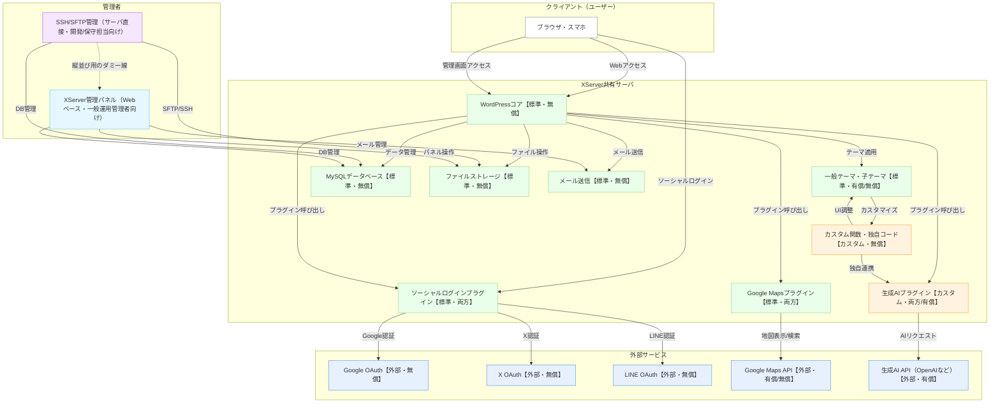

```mermaid
graph TD

  %% クライアント
  subgraph client["クライアント（ユーザー）"]
    browser["ブラウザ・スマホ"]
  end

  %% XServer上のWordPress環境
  subgraph xserver["XServer共有サーバ"]
    wp_core["WordPressコア【標準・無償】"]
    theme["一般テーマ・子テーマ【標準・有償/無償】"]
    plugin_login["ソーシャルログインプラグイン【標準・両方】"]
    plugin_gmaps["Google Mapsプラグイン【標準・両方】"]
    plugin_ai["生成AIプラグイン【カスタム・両方/有償】"]
    custom_code["カスタム関数・独自コード【カスタム・無償】"]
    db["MySQLデータベース【標準・無償】"]
    storage["ファイルストレージ【標準・無償】"]
    mail["メール送信【標準・無償】"]
  end

  %% 管理・運用者（縦並び用ダミー破線エッジ）
  subgraph admin["管理者"]
    ssh["SSH/SFTP管理（サーバ直接・開発/保守担当向け）"]
    xserver_panel["XServer管理パネル（Webベース・一般運用管理者向け）"]
    ssh -. "縦並び用のダミー線" .-> xserver_panel
  end

  %% 外部サービス
  subgraph ext["外部サービス"]
    google_oauth["Google OAuth【外部・無償】"]
    x_oauth["X OAuth【外部・無償】"]
    line_oauth["LINE OAuth【外部・無償】"]
    gmaps_api["Google Maps API【外部・有償/無償】"]
    ai_api["生成AI API（OpenAIなど）【外部・有償】"]
  end

  %% エッジ定義
  browser -- "Webアクセス" --> wp_core
  browser -- "ソーシャルログイン" --> plugin_login
  plugin_login -- "Google認証" --> google_oauth
  plugin_login -- "X認証" --> x_oauth
  plugin_login -- "LINE認証" --> line_oauth

  wp_core -- "テーマ適用" --> theme
  wp_core -- "プラグイン呼び出し" --> plugin_login
  wp_core -- "プラグイン呼び出し" --> plugin_gmaps
  wp_core -- "プラグイン呼び出し" --> plugin_ai
  wp_core -- "データ管理" --> db
  wp_core -- "ファイル操作" --> storage
  wp_core -- "メール送信" --> mail

  theme -- "カスタマイズ" --> custom_code

  plugin_gmaps -- "地図表示/検索" --> gmaps_api
  plugin_ai -- "AIリクエスト" --> ai_api

  custom_code -- "独自連携" --> plugin_ai
  custom_code -- "UI調整" --> theme

  browser -- "管理画面アクセス" --> wp_core

  %% 管理者運用系
  ssh -- "SFTP/SSH" --> storage
  ssh -- "DB管理" --> db
  xserver_panel -- "パネル操作" --> storage
  xserver_panel -- "DB管理" --> db
  xserver_panel -- "メール管理" --> mail

  %% ノードの色分け・役割区分
  style wp_core fill:#eaffea,stroke:#91d191
  style theme fill:#eaffea,stroke:#91d191
  style plugin_login fill:#eaffea,stroke:#91d191
  style plugin_gmaps fill:#eaffea,stroke:#91d191
  style db fill:#eaffea,stroke:#91d191
  style storage fill:#eaffea,stroke:#91d191
  style mail fill:#eaffea,stroke:#91d191

  style plugin_ai fill:#fff3df,stroke:#f4a442
  style custom_code fill:#fff3df,stroke:#f4a442

  style google_oauth fill:#e7f0fd,stroke:#5196db
  style x_oauth fill:#e7f0fd,stroke:#5196db
  style line_oauth fill:#e7f0fd,stroke:#5196db
  style gmaps_api fill:#e7f0fd,stroke:#5196db
  style ai_api fill:#e7f0fd,stroke:#5196db

  style ssh fill:#f6e6ff,stroke:#aa61e6
  style xserver_panel fill:#e6f7ff,stroke:#61c7e6

  style browser fill:#ffffff,stroke:#888888
```